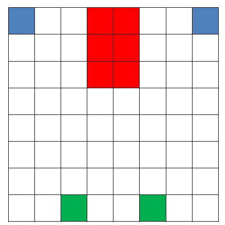

# Multi‑Agent Distributed Reinforcement Learning for grid Environment
In this project, I've Implemented a grid environment with 2 agents and 2 goal states. The agents have to learn to reach the goal states by receiving the maximum reward and avoiding obstacles.
The environment is shown below  
  

  
Elements of Environment:
- Agents: Blue Squares
- Obstacles: Red Squares
- Goal States: Green Squares

## Training
After training each agent lonely with the sarsa algorithm, I implemented several distributed algorithms like:
- Distributed On-Policy algorithms like SARSA
- Min-Max Q-Learning
- Belief Based Algorithm 
- Distributed Actor-Critic

## Results
The average Reward during the learning episodes for SARSA, Min-Max Q-Learning, and Belief-Based learning is shown Below:
  
- Average Reward during the learning episodes for SARSA  
  

  
- Average Reward during the learning episodes for SARSA  
  

  
- Average Reward during the learning episodes for Min-Max Q-Learning  
  

  
- Average Reward during the learning episodes for Belief Based Algorithms  
  

  
  
