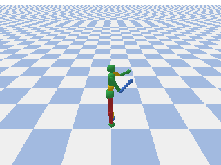
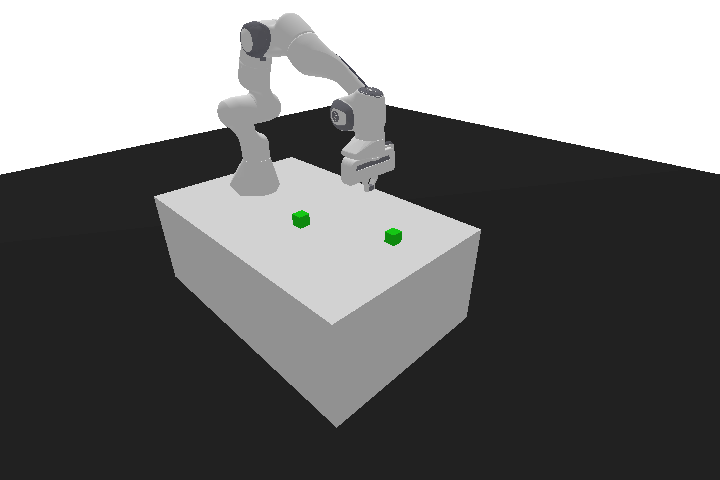

# Pybullet Physics Environments

Try to play with internersting pybullet-based environmentts and get a random render.  

you can  and use these environments for any method you want.

## Pybullet envs

 - `HumanoidBulletEnv-v0` from pybullet_envs library  

## Panda-Gym

 - `PandaPickAndPlace-v3` from panda_gym library  

