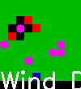

# Multi-Agent Deep Reinforcement Learning for Fighting Forest Fires
In this Project, we Implement a Forest Environment which in fires take place and our agents' goal is to stop the fire and save the forest. This Implementation is s part of the final project for the course Interactive Learning in the Autumn semester of 2022, University of Tehran.

## Environment
  

  
Elements of Environment:
- Forest: Green Area
- Areas without Tree: Brown Area
- Burnt forest: Black Area
- Drone Agents: Purple Squares
- Fire: Red Squares
- Houses: Blue Square
- Station of Drones: Yellow Square

In this environment, the fire spreads according to the wind and the defined probability of transition, and the task of the agents is to prevent the spread of fire by working together. One of the challenging problems of this environment is that it is non-stationary.

## Training
Each Agent is training with a Double-DQN and agents have the ability to communicate with each other in a certain environmental range for better coordination with a level of hierarchy in swarm intelligence.

## Results
Due to a Shortage of Computational power, we succeed to train the agents for just four hours. One of the test episodes after training is shown in the video below  
  

# Team members:
- [Banafsheh Karimian](https://github.com/BanafshehKarimian)
- [Erfan Mirzaei](https://github.com/erfunmirzaei)
