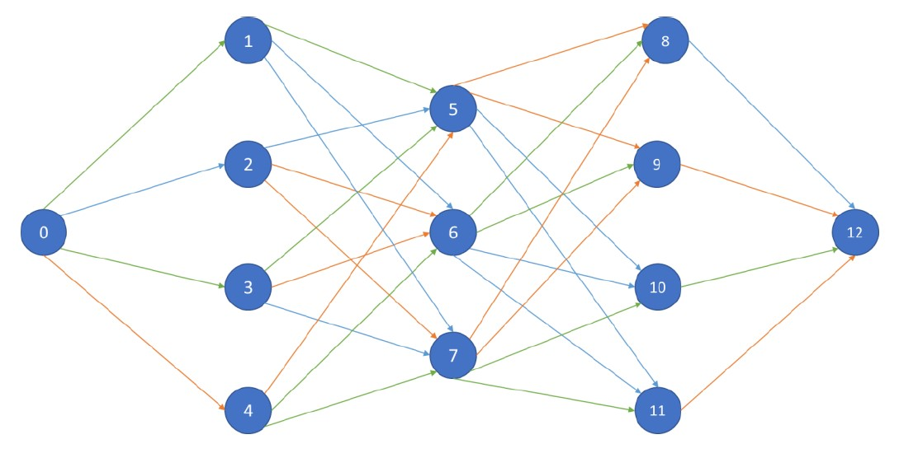
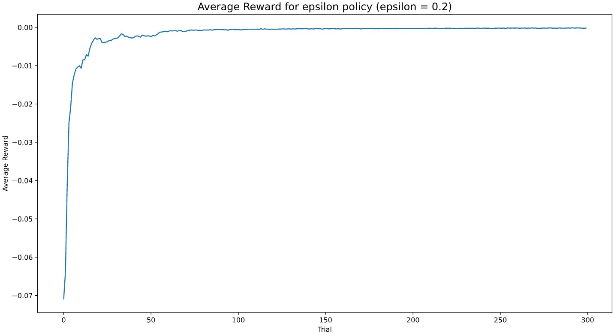
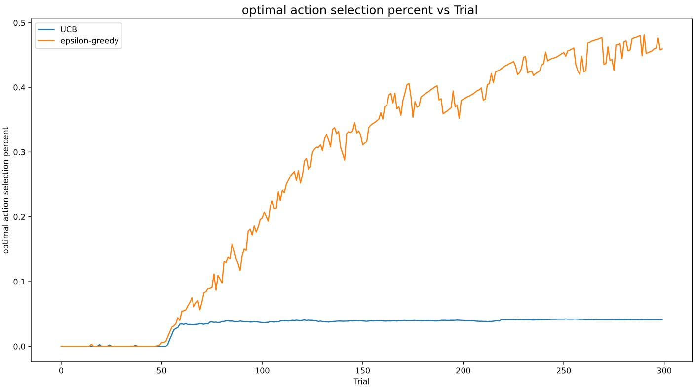

# Network routing with multi armed bandit algorithms

In this Project I've used Bandit Algorithms to solve the Problem of Routing for the graph in below:  
  

  
## Algorithms:  
For solving this task I've used different algorithms for multi-armed bandit problem like UCB and Epsilon-Greedy. eacch route in network is considered as an arm for multi-armed banidt and each arm has its own stochastic reward due to the delays that may occur during the route.

## Results
Below you can see the average reward for epsilon greedy algorithm and the percentage of optimal action selection for UCB and epsilon greedy algorithms:  

- average reward for epsilon greedy algorithm  
  

- percentage of optimal action selection for UCB and epsilon greedy  
  

